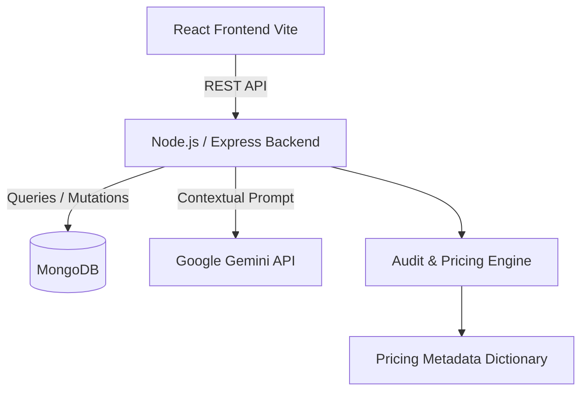

# Architecture

Overview of the system architecture, design decisions, and technical specifications.

## Overview
AI Spend Audit follows a modern, decoupled **Client-Server Architecture** utilizing a TypeScript-first tech stack across both the frontend and backend. 

The core platform evaluates an organization's AI tooling configurations against an embedded "Pricing Engine" to generate high-fidelity, deterministic cost-saving recommendations. The results are contextualized using a generative AI summary, persisted securely in a NoSQL database, and served to the user via an interactive, exportable dashboard.



## Components

### 1. Frontend Structure
Built with **React, TypeScript, and Vite**, the client prioritizes speed, type safety, and component reusability. 

- **UI & Routing:** Leverages `react-router-dom` for client-side routing.
- **Component Architecture:** Adopts a modular structure separating presentational components from stateful container pages (e.g., `ResultsPage.tsx`).
- **Client-Side Exporting:** Utilizes `html2canvas` and `jsPDF` for purely client-side rendering of visual audit dashboards into highly portable, CFO-ready PDF reports.
- **API Service Layer:** Abstracts all backend communication into typed request wrappers (e.g., `auditApi.ts`), ensuring UI components are agnostic of exact fetch mechanisms.

### 2. Backend Structure
Built on **Node.js, Express, and TypeScript**, the backend acts as a robust orchestrator that handles business logic, AI synthesis, and database operations.

- **Controller/Service Pattern:** Routing logic is kept incredibly thin, delegating heavy lifting to dedicated service modules (`auditEngine.ts`, `generateSummary.ts`).
- **Type Safety Across the Wire:** Shared interfaces (e.g., `IAuditInput`, `IAuditResult`) ensure that the payload schemas stay strictly enforced between the HTTP layer and the core processing engine.
- **AI Integration:** Seamlessly talks to the **Google Gemini API** (`gemini-2.0-flash`) via structured prompts, injecting calculated audit results to generate an executive summary. Includes a robust fallback generator if the API is unreachable or tokens are depleted.

### 3. MongoDB Models
The database layer relies on **Mongoose** to enforce schema validation and default behaviors.

- **Audit Model:** 
  - Stores raw user inputs (`teamSize`, `primaryUseCase`, configured `tools`).
  - Stores engine results (`totalMonthlySpend`, `totalMonthlySavings`, `recommendations`).
  - Indexed uniquely by a short `shareId` to power deterministic URL sharing.
- **Lead Model:** 
  - Links collected user information (`email`, `companyName`, `role`) directly to their generated `shareId`.
  - Built for GTM functions, enabling automated follow-ups with full contextual access to their audit.

## Core Engine & Logic

### 1. The Pricing Engine (`pricingData.ts`)
Instead of brittle external scraping, the system maintains a strictly typed local dictionary defining up-to-date metadata for AI tools.

```typescript
export interface IToolPlan {
  name: string;
  monthlyPrice: number | null;
  pricingType: "seat_flat" | "seat_plus_usage" | "pure_usage" | "hybrid";
  isProductionReady: boolean;
  recommendedMinTeamSize: number;
  // ...
}
```
This engine classifies tools into categories (`ai_assistant`, `ai_code_editor`, `ai_api`), defining nuanced structures like minimum seat thresholds, enterprise gatekeeping, and whether a plan is production-ready.

### 2. Audit Engine Flow
The main processor acts as a rules-based determinator mapping inputs to optimized outcomes:

1. **Hydration:** Raw input tools are matched against the local `pricingData.ts` to hydrate actual `IToolPlan` capabilities.
2. **Baseline Calculation:** The engine computes existing `totalMonthlySpend` by combining active seats with their assigned plan's unit economics.
3. **Optimization Pass:** The recommendation logic processes the hydrated data to spot inefficiencies (see below).
4. **Synthesis:** Monthly vs. optimized spends are diffed to output an actionable array of `totalMonthlySavings` and `totalAnnualSavings`.

### 3. Recommendation Logic
The platform synthesizes potential actions using the `IRecommendationMetadata` rules block:

- **Seat Consolidation (Team Size Triggers):** If a team registers 15 individual "Pro" seats, the engine detects that the team exceeds the `recommendedMaxTeamSize` for individual tiers and issues an `upgrade` / `switch_to_enterprise` action, which unlocks centralized billing and multi-tenant security, often with a bundled discount.
- **Overlap & Redundancy Detection:** Evaluates configured tools against the `alternativeTools` definitions. If an organization pays for an AI Assistant but their selected `primaryUseCase` is covered efficiently by an existing code editor or workspace AI, it issues a `consolidate` or `downgrade` recommendation.
- **Confidence Scoring:** Generates dynamic confidence labels (`high`, `medium`, `low`) based on how deterministically the mathematical threshold rules match the user's scenario.

## Sequence Diagram

```mermaid
sequenceDiagram
  **/assets/Sequence_Diagram.png**
    participant User
    participant UI as Client (React)
    participant API as Server (Express)
    participant Audit as Engine (auditEngine.ts)
    participant Gemini as Gemini API
    participant DB as MongoDB

    User->>UI: Input Tech Stack & Use Cases
    UI->>API: POST /api/audit (IAuditInput)
    API->>Audit: Process & Hydrate Pricing
    Audit->>Audit: Run Recommendation Logic
    Audit-->>API: Return Base Results & Savings
    
    par Parallel Operations
        API->>Gemini: Build Prompt & Request Summary
        Gemini-->>API: Yield Executive Summary Text
    and
        API->>DB: Save complete Audit Record
        DB-->>API: Return unique shareId
    end

    API-->>UI: Return full JSON (shareId, summary, savings)
    UI-->>User: Render Dashboard
    User->>UI: Click "Download PDF"
    UI->>UI: html2canvas + jsPDF execution
    UI-->>User: Output Audit.pdf
```

TBD
